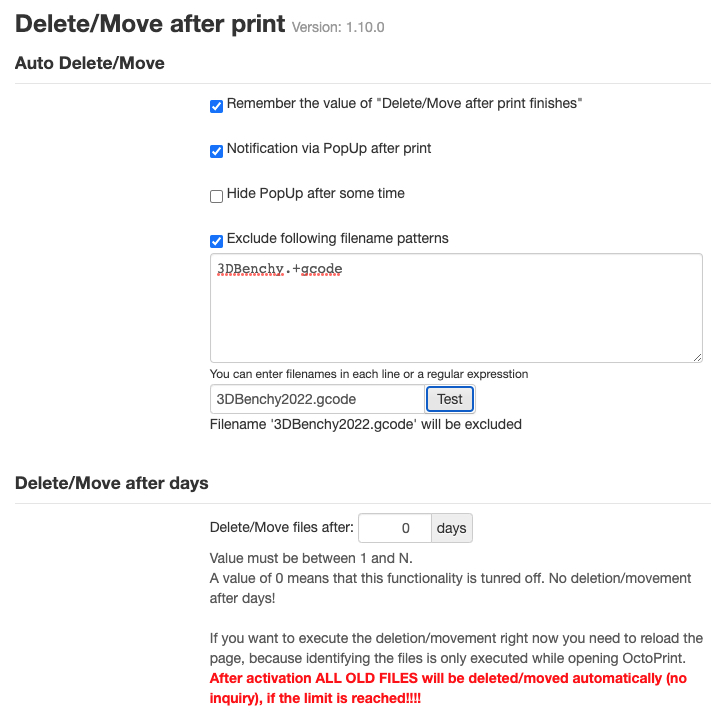

# DeleteAfterPrint

Delete automatically the Print-Model: 
* after successful print. If the print fails, the deletion is not executed!
* after predefined days

The user can enable automatic deletion after each print by using a checkbox in the sidebar.

If you want to delete files after a couple of days, use the Plugin-Settings. Deletion in done while opening OctoPrint.

**ATTENTION: There is no confirmation pop-up!!!** 

## Setup

Install via the bundled [Plugin Manager](https://github.com/foosel/OctoPrint/wiki/Plugin:-Plugin-Manager)
or manually using this URL:

    https://github.com/OllisGit/OctoPrint-DeleteAfterPrint/archive/master.zip

## Configuration

Settings can be edited in OctoPrint Plugin-Settings section.
